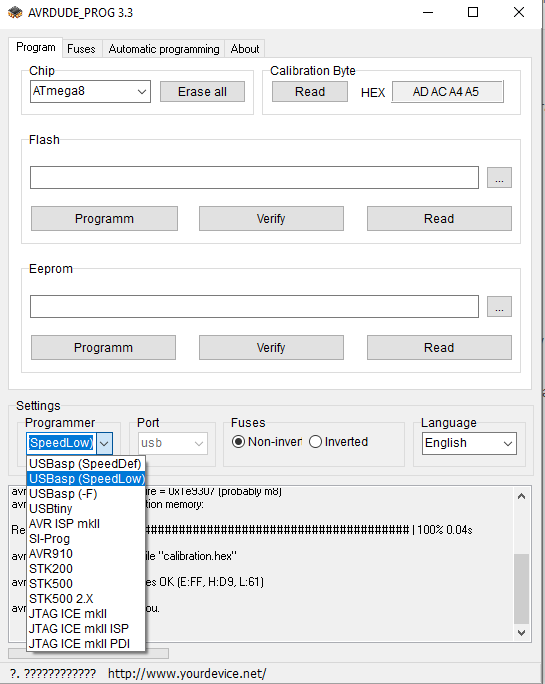

# Программатор AVRDude

## Степ 1 (скачать AVRDude)
https://www.yourdevice.net/proekty/avrdude-prog

## Степ 2 (скачать драйвер для USBAsap)
**usbasp-win-driver-x86-x64-v3.0.7**

## Запуск программы
 - Запускаем AVRDUDEPROG.exe
 - В "Settings" выбираем Programmer->USBasp(Speed Low)

